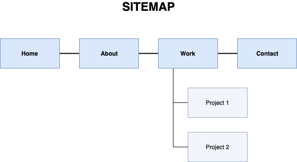

# Portfolio

By Natasha Khatri

### Published Website
https://tashk85.github.io/

### GitHub Repository
https://github.com/Jimfarrugia/ruby_hangman

### Description

Design, build, deploy and present a portfolio website.

### Purpose

The purpose of the portfolio website is to demonstrate my skills, abilities and coding experience to prospective employers. It also provides them my contact details, study and work history, links to my Github and LinkedIn accounts and an idea of my personality through the text and overall design.

### Functionality / Features
- Simple one page website with anchor links to the three main sections: About, Work and Contact.
- Responsive design throughout including navigation menu. When below 768px, the menu is displayed as a dropdown menu through use of the burger symbol. 
   - I would like to improve on this through implementing Javascript to allow it to toggle on and off when you click on a link. Currently, because of the use of the checkbox input feature the user needs to click the burger icon again to close the menu.
- Flexbox positioning for the About and Work sections to allow for responsive sizing.
   - As I add projects onto the website, I would like to change the grid layout to be more aesthetically appealing.
- CSS Animations for the anchor links, and project examples in Work section.
- HTML Tables used for the Work and Study history text.

### Sitemap

### Screenshots

### Target audience
Prospective employers

### Tech stack
HTML
CSS / SASS
Github Pages

### DESIGN DOCUMENTATION
#### Design Process
  
 
 
 
 
 

#### Wireframes
 

#### Personal Logo
  

#### Usability Considerations
I have tried to follow the A11Y checklist, although I was confused with the results that came up on the W3C Validator. This is something I would like to study further, so I will need to add more accessibility features in future. 

### DETAILS OF PLANNING PROCESS
#### Project Plan & Timeline
  

#### Screenshots of Trello Board
  

### SHORT ANSWER Q&A

